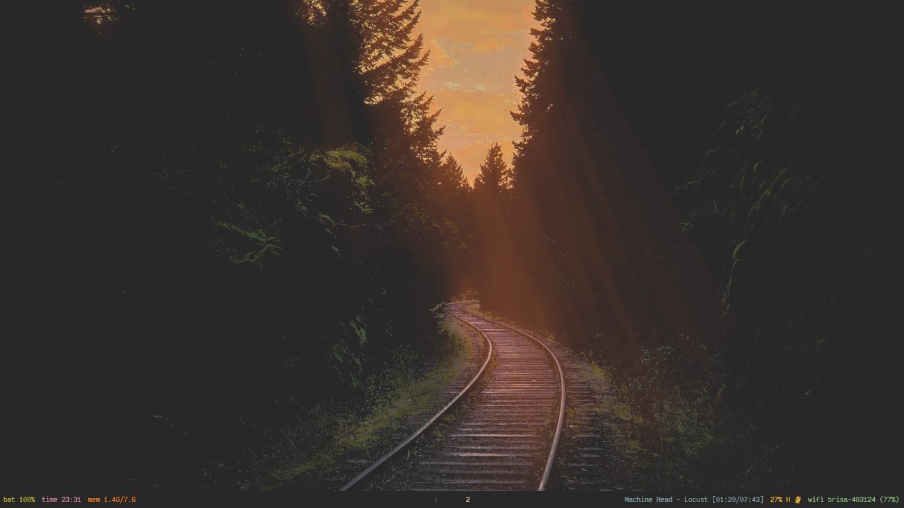
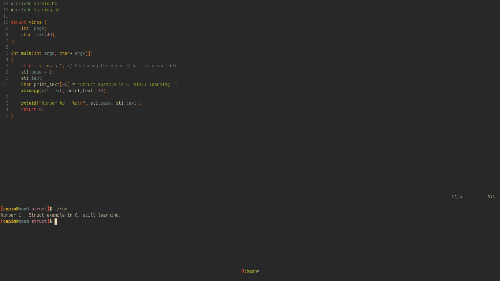

# ***Gruvrice***

_Some inspirations:_ 
- [Gruvbox](https://github.com/morhetz/gruvbox)
- [Luke Smith](https://github.com/lukesmithxyz)
- [Mental Outlaw(Luke's deepfake)](https://github.com/MentalOutlaw)
- Sick of Windows

## Software used

Window Manager
- [sway](https://github.com/swaywm/sway)

Browser
- [librewolf](https://librewolf.net/)

Text Editor
- [nvim](https://github.com/neovim/neovim)

Terminal Emulator
- [foot](https://github.com/DanteAlighierin/foot)

Notification Center
- [mako](https://github.com/emersion/mako)

Music
- [mpd](https://github.com/MusicPlayerDaemon/MPD)
- [ncmpcpp](https://github.com/ncmpcpp/ncmpcpp)
- [lingot](https://github.com/ibancg/lingot)

PDF Viewer
- [zathura](https://github.com/pwmt/zathura)

### sway + waybar

### librewolf + startpage

### neovim

### ncmpcpp and lingot

### zathura

### mako notification

### dunst notification

